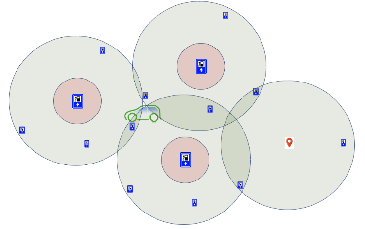

# Charge station based routing


**`Charge Station based Routing` means treat `charge stations` as `nodes` in graph, `weight` between `nearby` or `reachable` charge stations as `edges`, and then apply classic routing algorithm, such as `Dijkstra`, to calculate best solution**.  For development stories please go to [#231](https://github.com/Telenav/osrm-backend/issues/231).

<br/>


## General idea

If `Orig` and `Dest` has some distance in between, let's say needs at least one charge time.
We could find all charge stations which could be reached for start point and all charge stations are needed to reach destination, if there are overlap in between, then we could end up with single charge station, otherwise, calculate the best route based on charge station network, node is charge station, edge is reachable charge station for each charge station.



If we pro-process all charge stations in the graph and record the `connectivity` for each charge station, which means for each single charge station, we could retrieve  **all reachable charge stations sorted by distance or energy needed**, then we could calculate optimal result based on classic algorithm.


## Design

### Pre-process work flow

```
Telenav's Database(postGIS) 
       -> csv 
               -> adjust column name 
                       -> convert csv to json 
                                 -> decoding json
```
More information [#237](https://github.com/Telenav/osrm-backend/issues/237) 


### JSON Input
Electricity charge stations, expect input in JSON format follow OSM's tag definition about [node](https://wiki.openstreetmap.org/wiki/Node) and [charging_station](https://wiki.openstreetmap.org/wiki/Tag:amenity%3Dcharging_station), example:
```json
{
   "id": 12345,
   "lat": 51.5173639,
   "lon": -0.140043,
   "amenity": "charging_station",
   "operator": "NOFT",
   "fee": "yes",
   "capacity":4,
}
```
- Later could implement more input connector: pbf, csv, etc.

### Pre-Processing
- For each charge station point, calculate its google s2 cellid
   + For each point, it could have cellid in [0, 30] levels.  We just pick a range from them, such as [10, 20].
   + The range used for pre-processing will be the same as query
- For each charge station point, take which as center and construct a circle whose radius is a hard code max drive range value(500km), query for all cells it could touch, only record the one contains charge stations
  + Make sure such function could work: give a cell id(not station id) could retrieve all cells it could reached by.  We also need to distinguish the stations could be reached by charging how much of energy
  + Make sure exact distance between charge stations has been recorded in db
  + For production, circle should be replaced by `reach range`(or `isoline`, consider elevation, red/lights, energy pattern, etc)
- More infor about google S2
  + [How S2 cell is generated](https://github.com/CodeBear801/tech_summary/blob/master/tech-summary/navigation/spatial_index/google_s2_cell.md)
  + [How hilbert curve works](https://github.com/CodeBear801/tech_summary/blob/master/tech-summary/navigation/spatial_index/hilbert_curve.md)
  + [#236](https://github.com/Telenav/osrm-backend/issues/236)

### Query
- Given two points of orig/dest
- Check whether orig/dest is reachable by current energy
- If not start two strategy together: `charge station based routing` and `search along route`
- logic of `charge station routing`
   + For input, need using its current energy to filter all charge station it could reached
   + For Dest, check all charge station needed to reach destination
        *  Check whether there is overlap between those two, if yes, then go to next step
        * For all reachable stations from start, generate a reachable cellids by combine each charge station's 1-time-charge reachable cells result, see whether there is any overlap with dest's stations(or cellids contain those stations), if yes, go to next step
        * For each reachable charge station of start, they have their unique value of `arrival energy`, this value need to be considered during calculating `charge times`, but the exist status of each charge station is fixed: such as charge to 60% of energy, 80% of energy, etc.
        *<del> For all reachable stations from start, generate a reachable cellids by combine each charge station's 2-times-charge reachable cells result, see whether there is any overlap with dest's stations(or cellids contain those stations), if yes, go to next step  </del>
   + Construct graph to calculate most suitable charge stations
               * Except `start` and `end`, `nodes` are charge stations, `edge` is the connection between stations. 
               * `charge time` value need to be assigned properly

- The algorithm used for calculating shortest path between two points in geo-graphical map still works here, just with some adjustment on `node` and `edge`'s definition
    + `nodes` are charge stations, and each charge station might have several status: charge to 60%, charge to 80%, charge to 100% of total energy
    + `edges`' weight could be duration, payment or the combination.  But `charging time` is the new information need to be considered
    + There could be multiple ways to reach a certain `node`, but we just record one with minimum `weight`, thus, the dynamic value of `arrival energy` is fixed due to the path and solution is fixed
    + More information could go to here: https://github.com/Telenav/osrm-backend/issues/208
    + May be we don't need bboltdb at running time at all :)
    + The graph is a `dense` graph, may be we could try with `MLD` to speed up


## More info
- https://github.com/Telenav/osrm-backend/issues/196
- https://github.com/Telenav/osrm-backend/issues/208
